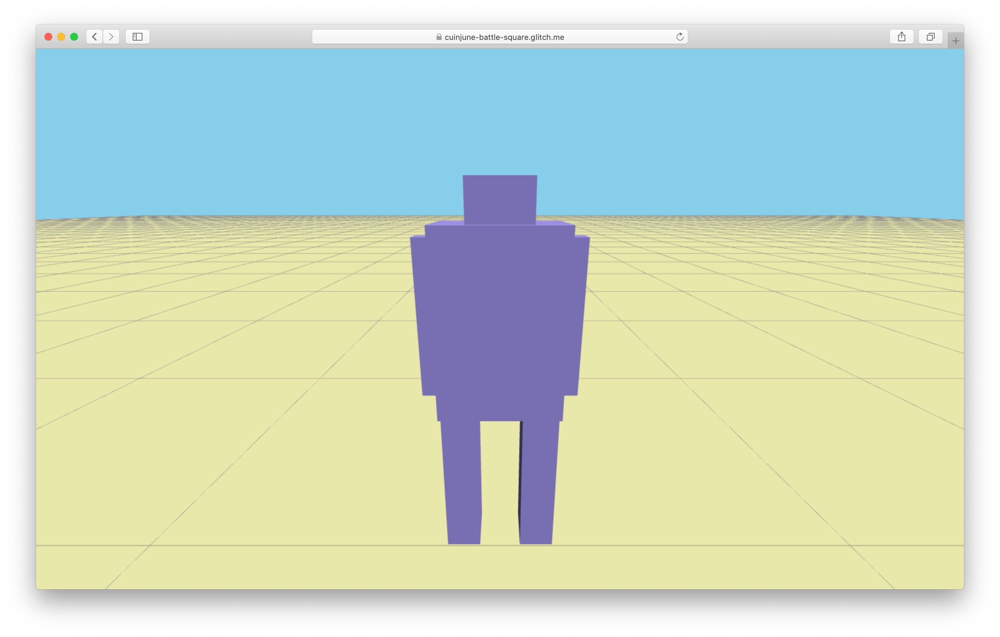

# Battle Square


Battle Square is a third-person 3D multiplayer battle game. (in progress) 

The goal is to build a simple, minimal, and fun game that anyone can easily play in the web browser.

Here's the [Live Demo on Glitch](https://cuinjune-battle-square.glitch.me/).

## How to play
* Enter the player name and press the start button. (The player's look will be determined by the name you give to it)
* `W, A, S, D` keys move the player forward, left, backward, and right.
* `Space` key makes the player jump.
* `Mouse` movement makes the player look around.
* `Click` makes the player use arms to hit something. (Currently, players can't actually hit each other yet)
* Let your friends join and play together.

## Future plans
* Show the names of the connected players.
* Design the background area. (e.g. walls, boxes)
* Implement how the player interacts with the background objects.
* Implement how players interact with each other.
* Add an energy status bar for each player.
* Rank players by the number of kills.
* Add the text chatting feature.
* Apply shadow to the world.
* Add music and sound.
* Add items that appear in random locations. (e.g. potion, shield, speed up, power up, gun, etc) 

## Setup
1. Installation of node.js is required. Follow [this guide](https://github.com/itp-dwd/2020-spring/blob/master/guides/installing-nodejs.md) to install it.
2. Run the following commands in the Terminal.
```
git clone https://github.com/cuinjune/battle-square.git
cd battle-square
npm install dependencies
npm start
```
3. Open your web browser and navigate to http://localhost:3000

## Tools & Libraries used
Three.js, Socket.io, Seedrandom.js, Node.js, Express.js

## References
* https://github.com/AidanNelson/threejs-webrtc
* https://github.com/inkfood/Smooth-camera-with-ThreeJS
* https://github.com/mrdoob/three.js/blob/dev/examples/misc_controls_pointerlock.html

## Reporting bugs
Please post an [issue](https://github.com/cuinjune/battle-square/issues) if you face any problem using the app.

## Author
* [Zack Lee](https://www.cuinjune.com/about): an MPS Candidate at [NYU ITP](https://itp.nyu.edu).
